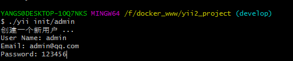

1. ##### 创建管理员表  
进入项目根目录，在根目录执行命令：
``` bash
$ ./yii migrate
```
2. ##### 创建管理的控制器  
``` bash
$ cd console/controllers/
```
  编写代码如下：
``` php
<?php

namespace console\controllers;

use common\models\UserLoginToken;
use Yii;
use yii\console\Controller;
use common\models\User;

class InitController extends Controller
{

    /**
     * Create init user
     */
    public function actionAdmin()
    {
        echo "创建一个新用户 ...\n";// 提示当前操作
        $username = $this->prompt('User Name:'); // 接收用户名
        $email = $this->prompt('Email:'); // 接收Email
        $password = $this->prompt('Password:');// 接收密码
        $model = new User(); // 创建一个新用户
        $model->username = $username; // 完成赋值
        $model->email = $email; // 完成赋值
        $model->generateAuthKey();
        $model->generatePasswordResetToken();

        /**
         * 在读取和写入对象的一个不存在的成员变量时， __get() __set() 会被自动调用。 Yii正是利用这点，提供对属性的支持的。从上面的代码中，
         * 可以看出，如果访问一个对象的某个属性， Yii会调用名为 get属性名() 的函数。如， $model->password ， 会自动调用 $model->setPassword() 。
         * 如果修改某一属性，会调用相应的setter函数。
         */
        $model->password = $password;
        // 保存新的用户
        if (!$model->save()) {
            // 如果保存失败，说明有错误，那就输出错误信息。
            foreach ($model->getErrors() as $error) {
                foreach ($error as $e) {
                    echo "$e\n";
                }
            }
            return 1; // 命令行返回1表示有异常
        }
        return 0; // 返回0表示一切OK
    }
}
```
3. ##### 执行脚本  
``` bash
$ ./yii init/admin
```
  然后分别输入帐户、Email、登录密码，完成创建。

 
  